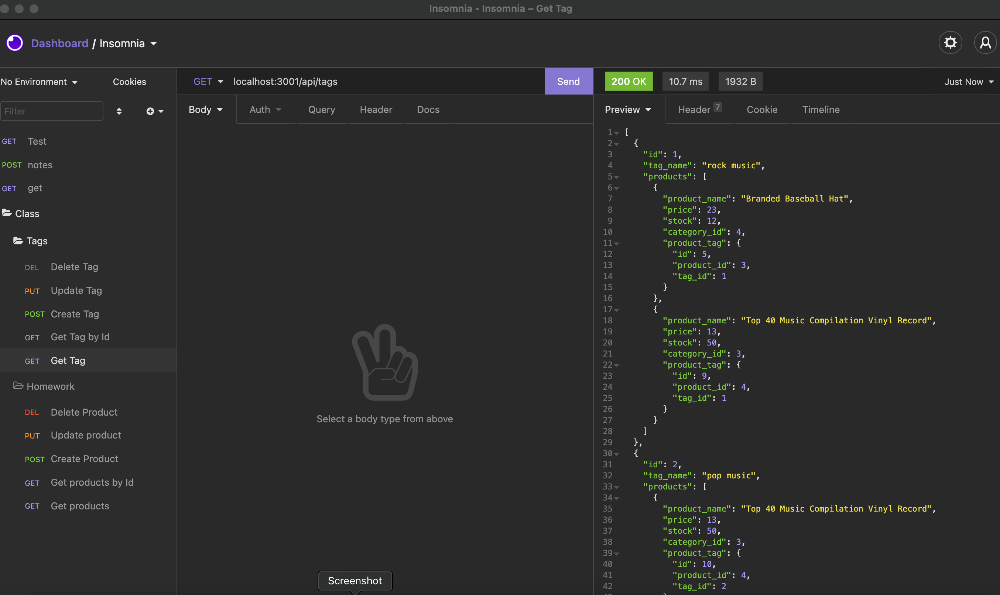

# E-Commerce Back End

---

## Description
This is a back end application that allows you to control inventory by creating, adding, updating and deleting products

## Table of Contents
* [Installation](#installation)
* [Usage](#usage)
* [Contributions](#contributions)
* [License](#license)
* [Questions](#questions)

## Installation
npm i

## Usage
npm start

## Contributions
Feel free to use any code as needed

## License 
Licensed under the MIT License. Copyright © 2021

## Questions
*For any additional questions, you can find me at* 

GitHub: [@ZagalJ](https://github.com/ZagalJ/)

Email: [Jonathan.Zagal@hotmail.com](mailto:Jonathan.Zagal@hotmail.com)

Link to [demo](https://watch.screencastify.com/v/qKxNUjmikBJemNg8Ca6V)

Link to [demo 2](https://watch.screencastify.com/v/6spvSkTGDk6An4m2u1wS)

Link to [demo 3](https://watch.screencastify.com/v/UJe5nfdn7pUn7bcpijRR)
